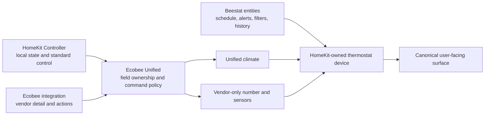

# Architecture

## Outcome

Create one canonical Home Assistant thermostat device surface for each mapped
physical thermostat while retaining specialized backend ownership. One unified
climate is the primary control surface; colocated sibling entities expose only
non-duplicate Ecobee capabilities and Beestat-owned entities remain the
schedule/history presentation. Raw backends remain enabled for acquisition,
diagnosis, and rollback.

## Ownership Boundaries

Ecobee Unified owns mapping, field selection, degradation, command routing,
command confirmation, and unified entities. It does not own transport,
authentication, raw source devices, or historical import.

It must use Home Assistant's public state machine, registry, event, and service
interfaces. It must not import another integration's runtime data object,
write `.storage`, call the Ecobee API, or scrape diagnostics.

Use one config entry to hold multiple thermostat mappings. This keeps the
cross-mapping identity and concurrency rules atomic and uses Home Assistant's
native single-entry integration flow. Config subentries are not used: the
mappings do not have independent authentication or lifecycle, already surface
as separate thermostat devices, and Core 2026.8 restricts a device to one
config entry and at most one subentry. A mapping contains:

- required HomeKit climate source;
- required Ecobee climate source for the intended full feature set;
- optional HomeKit current-temperature sensor, current-mode select, and
  clear-hold button on that device;
- optional Ecobee AQI, CO2, VOC, and notification entities on the Ecobee source
  device.

The HomeKit device serial and Ecobee device identifier must independently prove
that the two required climates represent the same physical thermostat. New or
changed mappings fail closed when identity is missing or mismatched. A saved
temporarily missing mapping remains recoverable, but runtime cloud reads,
vendor actions, notification writes, and cross-interface metadata fusion stay
disabled until registry evidence proves the pairing again.

Beestat schedule, transition, filter, alert, and history entities are not
remapped into this config entry. Beestat owns their transport/storage and links
them independently to the same HomeKit device.

Mappings use entity/device selectors and supported entity-registry tracking so
renames survive. A missing source must not be replaced using name guesses.

Reconfiguration captures the complete entry-data snapshot before edits and
fails closed if current data differs at completion. A successful save starts
from that accepted snapshot and replaces only the mapping collection, preserving
additive or unrecognized fields without merging data from a concurrently changed
entry.

## Device Model

Every unified climate, number, sensor, and notification entity links to the
selected physical HomeKit thermostat device using Home Assistant's current
helper-device linking pattern.
The integration must not return foreign identifiers or connections and must not
claim co-ownership of that device. If the source device is missing, keep the
entity registered and report degraded/unavailable state.

The link follows the selected source entity rather than only its setup-time
device. Entity/device registry changes reconcile all owned entity-registry
records in place; moving, detaching, removing, or restoring the HomeKit source
does not recreate or reload the config entry and never mutates foreign records.
Optional HomeKit and Ecobee sibling capabilities remain valid only while their
registry entities stay on the selected source device; association drift
degrades only the affected capability and blocks its writer before effects.
Identity drift between the two required source devices preserves local HomeKit
state/control but disables all Ecobee-derived semantics and creates a bounded
Repair until the supported registry identities match again.

## Deterministic Field Ownership

| Semantic | Primary | Read fallback | Notes |
|---|---|---|---|
| HVAC mode and action | HomeKit climate | Ecobee climate | Local state is canonical for normal operation. |
| Target temperature/range | HomeKit climate | Ecobee climate | Reads may fall back, but unit and safety bounds remain HomeKit-writer-owned. The Ecobee target step is an explicit same-device metadata fusion only when Core writer granularity is independently proven and the HomeKit adapter omits the step. |
| Current temperature | Explicit same-device HomeKit temperature sensor when mapped, valid, and consistent with the current HomeKit climate serialization envelope; otherwise HomeKit climate | Ecobee climate `current_temperature` only when the local climate chain is unavailable | The explicit sensor preserves honest accessory precision without trusting a silent divergent duplicate projection. Require temperature class, compatible unit, finite state, same-device association, and agreement within half of Core's unit-specific climate display step; otherwise degrade explicitly and fall back. |
| Current humidity | HomeKit climate | Ecobee climate | Expose only when valid. |
| Target humidity and bounds | HomeKit climate | none | Advertise and write only when the mapped HomeKit writer exposes the capability and valid bounds; confirm from its report. |
| Fan mode | HomeKit climate | Ecobee climate | Standard climate capability. |
| Preset/current mode | HomeKit current-mode select | none | Capability-advertised climate preset; local writer only. |
| Ecobee preset/climate context | Ecobee climate | none | Bounded vendor diagnostic context, not the preset writer. |
| Equipment stage | Ecobee climate | none | Project a bounded translated enum sensor; do not retain raw equipment text in Recorder. |
| Minimum fan runtime | Ecobee climate/action | none | First-class number and the sole Ecobee writer; accept only the writer's advertised five-minute increments. |
| Active comfort sensors | Ecobee climate | none | Do not infer from occupancy. |
| Scheduled profile/next transition | Beestat entities on the device | none | First-class Beestat presentation; never duplicate as climate attributes. |
| Room motion/occupancy/battery | HomeKit sibling entities | none | Keep as linked sibling entities; do not copy into climate attributes. |
| Air-quality estimates | Ecobee sibling entities | none | Require the mapped Ecobee device plus the role's exact device class and unit contract; keep separate because they are contextual estimates, not life-safety measurements. |
| Thermostat-display notification | Ecobee notification entity | none | Optional Unified notification facade; one mapped writer and no delivery failover. |
| History/filter/alerts | Beestat-derived entities | none | Do not re-export historical series through the climate entity. |

Selection is semantic, not temporal. Do not average duplicate measurements or
select a source merely because its event arrived last. Report chosen source and
source health compactly so provenance remains inspectable without presenting
duplicate normal-use entities. Exact continuously advancing ages are calculated
from the selected sources and command tracker when bounded diagnostics are
requested, so ordinary source reports do not create climate history rows
without a semantic state change. All other diagnostic semantics remain a
projection of the immutable normalized snapshot.
Writable features, safety bounds, modes, and options always come from the
documented writer. A read fallback may preserve current state, but it never
expands the controls advertised while that writer is unavailable. For the
HomeKit Current Mode select specifically, an `unknown` current option is an
unreadable value rather than writer unavailability: an enabled, available,
same-device select may continue to advertise its bounded options while Unified
keeps the current preset unknown. Actual unavailability still removes control.

## Updates and Availability

Subscribe to source state changes and maintain an in-memory snapshot. Entity
properties perform no I/O. Build one normalized per-mapping snapshot and make
the climate entity, diagnostics, and any diagnostic entity project that same
snapshot rather than interpreting raw attributes independently. Availability is
capability-aware:

HomeKit can report a climate's serialized whole-degree temperature and its
same-accessory precise temperature characteristic as sequential state changes.
For mappings that explicitly select both, routine healthy precise-sensor events
and climate events whose current temperature changed use one keyed 250 ms
trailing-edge settle window before snapshot publication. The window is per
mapping and preserves the latest report time for each source. Command
confirmation observations, other climate changes, source removal,
unavailable/unknown transitions and recovery, registry/device events, and every
unrelated source remain immediate.
A mismatch that persists after the window still degrades and falls back exactly
as documented; the window never changes source ownership or health.

- HomeKit available: canonical local climate state and standard control work.
- Ecobee available with same-physical-device identity proven: vendor
  detail/actions work.
- Beestat independently available: its sibling schedule/history context works;
  Ecobee Unified does not consume it as a mapped source.
- A missing optional source removes only its capabilities.
- A missing primary may activate the documented read fallback, accompanied by
  degraded status and provenance.
- If neither climate source can provide a required state, the unified climate
  becomes unavailable rather than inventing state.

Source availability and observation age are independent. HomeKit is a local
push/event source without a heartbeat contract, so a quiet but available state
remains healthy regardless of `last_reported` age; its age is diagnostic and
command-observation evidence only. Ecobee cloud sources have a cadence contract,
so their freshness uses `last_reported` and lifecycle-owned timers reevaluate
their stale boundaries even when no new state-change event arrives. The
calibrated default is 30 minutes: above the observed cloud-reporting tail while
remaining a bounded silent-wedge guard. Event handlers use the event-owned
stable timestamp rather than Core's intentionally
mutable `State.last_reported` field. A filtered report listener rebuilds a
mapping only while its cadence-backed source is stale or while that exact
source owns pending command confirmation; ordinary healthy unchanged reports
do not dispatch snapshot updates or create Recorder churn. Age never makes a
source look more precise or changes deterministic ownership by itself.

Unconfigured optional sources are omitted from source-health diagnostics.
Configured references that are currently absent remain present with `missing`
health. Proven cross-backend identity mismatch is distinguished from temporarily
unproven identity so diagnostics describe the actionable fault. A source whose
entity exists but reports `unknown` retains distinct `unknown` health and
degradation rather than being mislabeled `unavailable`; it remains unusable for
reads, while a separately proven writer can stay available when its contract
allows an unreadable current value.

## Command Policy

Exactly one backend writes each operation:

| Operation | Writer | Policy |
|---|---|---|
| Set HVAC mode | HomeKit climate | No automatic fallback. |
| Set temperature/range | HomeKit climate | No automatic fallback. |
| Set fan mode | HomeKit climate | No automatic fallback. |
| Set preset/current mode | Explicit HomeKit select | Capability-advertised options only; no fallback. An unreadable current option does not disable an otherwise available same-device writer. |
| Resume/clear hold | Explicit HomeKit clear-hold button | Local action exactly once; a successful button call is reported as submitted because no source state can prove the hold cleared. It does not require the independent current-mode select. |
| Set minimum fan runtime | Ecobee action through unified number | Vendor-specific action exactly once. |
| Send thermostat-display notification | Explicit Ecobee notification entity | One message exactly once; unsupported title is ignored and no fallback is attempted. |
| Vacation and occupancy/sensor policy | Ecobee actions | Vendor-specific and opt-in. |

Serialize effect dispatch per mapping so a slower earlier writer call cannot
finish after and overwrite a later user command. Give every command a
monotonically increasing revision, mark it pending while its sole writer is
awaited, and permit source confirmation only after that writer returns
successfully. A matching observation received during dispatch may be retained
and applied after success, but a later writer failure always leaves that
revision failed. After a successful standard HomeKit command, observe the
operation-owned source and update confirmation only if the observation still
belongs to the current revision. A late cloud update must not confirm or fail a
superseded command. Start the confirmation timeout after writer success; a
timeout reports an unconfirmed command and must not send a second write. The
default confirmation window is 30 minutes, calibrated above the observed
cloud-reporting tail and still subject to command-specific shadow validation.
Temperature observations use a writer-step-aware tolerance capped at half of
the mapped HomeKit target step so ordinary HomeKit/Ecobee quantization can
confirm without accepting a different target. Non-temperature confirmation
retains its strict fixed tolerance. Clear Hold is submitted, not state-confirmed.
Normal source processing must continue while confirmation is pending. A
matching Ecobee state report counts
as a new observation even when state and attributes are unchanged; report-event
handling retains the same revision guard. Every service facade injects its
resolved mapped entity after validating caller data, so caller-provided service
data cannot redirect a command to another entity.

## Entity Surface

Source candidate per thermostat:

1. One unified climate with optional HomeKit preset support.
2. An optional Unified resume-program button backed by one explicitly mapped
   HomeKit Clear Hold writer.
3. One Ecobee minimum-fan-runtime number.
4. One bounded equipment-stage sensor.
5. Optional AQI, CO2, and VOC sensors only when explicitly mapped.
6. An optional thermostat-display notification entity backed by one explicitly
   mapped Ecobee writer.
7. Existing Beestat schedule/filter/alert entities linked independently to the
   same device; no re-export or Recorder ownership transfer.

Unified climate actions also expose bounded vacation creation/deletion,
Smart Home/Away and Follow Me policy, and comfort-sensor participation. They
always inject the mapping's Ecobee climate target and issue one Ecobee service
call. Sensor participation translates Home Assistant's native lowercase
built-in preset values to the Ecobee action's exact comfort-profile names; an
omitted value uses the bounded current Ecobee climate-mode projection rather
than forwarding the source integration's normalized preset string. Vacation
temperatures use that mapped writer's current unit and advertised
bounds. Because public source state cannot prove the complete resulting vacation
or policy definition, a successful action is reported as `submitted`,
not falsely `confirmed`; service errors remain `failed`. Microphone and
daylight-saving administration remain outside the routine thermostat surface.

Keep climate attributes bounded: selected sources, source status,
active climate mode/sensors and command confirmation. Schedule/transition,
equipment stage, and minimum fan runtime have first-class owners. Do not record large raw
payloads, long lists, historical samples, or continuously advancing ages as
attributes. Active-sensor detail and command-confirmation operation/status
remain live but unrecorded; bounded redacted diagnostics calculate exact source
and command ages at request time while retaining the snapshot's selected-source
and command semantics. This avoids the Core state-machine comparison that
otherwise creates Recorder rows before unrecorded attributes are stripped from
storage.

## Derived Expansion

After MVP correctness, explicit room mappings can support genuinely new
semantics without duplicating raw entities:

- effective program state (scheduled versus hold);
- active-room temperature spread and hottest/coldest active room;
- persistent cross-source disagreement;
- command-confirmation status and latency;
- scheduled sensor-participation anomalies; and
- air-quality trend/context with clear non-safety labeling.

Each derived metric needs a precise definition, unit, availability rule,
Recorder value, and demonstrated consumer before it becomes an entity.
