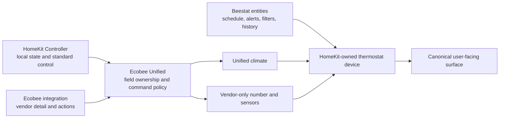

# Architecture

## Outcome

Create one canonical Home Assistant thermostat device surface for each mapped
physical thermostat while retaining specialized backend ownership. One unified
climate is the primary control surface; colocated sibling entities expose only
non-duplicate Ecobee capabilities and Beestat-owned entities remain the
schedule/history presentation. Raw backends remain enabled for acquisition,
diagnosis, and rollback.

## Ownership Boundaries

Ecobee Unified owns mapping, field selection, degradation, command routing,
command confirmation, and unified entities. It does not own transport,
authentication, raw source devices, or historical import.

It must use Home Assistant's public state machine, registry, event, and service
interfaces. It must not import another integration's runtime data object,
write `.storage`, call the Ecobee API, or scrape diagnostics.

Use one config entry to hold multiple thermostat mappings unless current Home
Assistant UX or lifecycle evidence demonstrates that independent entries are
materially better. A mapping contains:

- required HomeKit climate source;
- required Ecobee climate source for the intended full feature set;
- optional HomeKit current-mode select and clear-hold button on that device;
- optional Ecobee AQI, CO2, and VOC sensors on the Ecobee source device.

Beestat schedule, transition, filter, alert, and history entities are not
remapped into this config entry. Beestat owns their transport/storage and links
them independently to the same HomeKit device.

Mappings use entity/device selectors and supported entity-registry tracking so
renames survive. A missing source must not be replaced using name guesses.

## Device Model

Every unified climate, number, and sensor entity links to the selected physical HomeKit
thermostat device using Home Assistant's current helper-device linking pattern.
The integration must not return foreign identifiers or connections and must not
claim co-ownership of that device. If the source device is missing, keep the
entity registered and report degraded/unavailable state.

The link follows the selected source entity rather than only its setup-time
device. Entity/device registry changes reconcile all owned entity-registry
records in place; moving, detaching, removing, or restoring the HomeKit source
does not recreate or reload the config entry and never mutates foreign records.
Optional HomeKit and Ecobee sibling capabilities remain valid only while their
registry entities stay on the selected source device; association drift
degrades only the affected capability and blocks its writer before effects.

## Deterministic Field Ownership

| Semantic | Primary | Read fallback | Notes |
|---|---|---|---|
| HVAC mode and action | HomeKit climate | Ecobee climate | Local state is canonical for normal operation. |
| Target temperature/range | HomeKit climate | Ecobee climate | Reads may fall back, but unit and safety bounds remain HomeKit-writer-owned. The Ecobee target step is an explicit same-device metadata fusion only when Core writer granularity is independently proven and the HomeKit adapter omits the step. |
| Current temperature | HomeKit climate `current_temperature` | Ecobee climate `current_temperature` | Never substitute a raw thermostat-local sensor; it can represent a different semantic. |
| Current humidity | HomeKit climate | Ecobee climate | Expose only when valid. |
| Target humidity and bounds | HomeKit climate | none | Advertise and write only when the mapped HomeKit writer exposes the capability and valid bounds; confirm from its report. |
| Fan mode | HomeKit climate | Ecobee climate | Standard climate capability. |
| Preset/current mode | HomeKit current-mode select | none | Capability-advertised climate preset; local writer only. |
| Ecobee preset/climate context | Ecobee climate | none | Bounded vendor diagnostic context, not the preset writer. |
| Equipment stage | Ecobee climate | none | Project a bounded first-class sensor; do not retain raw equipment text in Recorder. |
| Minimum fan runtime | Ecobee climate/action | none | First-class number and the sole Ecobee writer. |
| Active comfort sensors | Ecobee climate | none | Do not infer from occupancy. |
| Scheduled profile/next transition | Beestat entities on the device | none | First-class Beestat presentation; never duplicate as climate attributes. |
| Room motion/occupancy/battery | HomeKit sibling entities | none | Keep as linked sibling entities; do not copy into climate attributes. |
| Air-quality estimates | Ecobee sibling entities | none | Keep separate; they are contextual estimates, not life-safety measurements. |
| History/filter/alerts | Beestat-derived entities | none | Do not re-export historical series through the climate entity. |

Selection is semantic, not temporal. Do not average duplicate measurements or
select a source merely because its event arrived last. Report chosen source and
source age compactly so provenance remains inspectable without presenting
duplicate normal-use entities.

## Updates and Availability

Subscribe to source state changes and maintain an in-memory snapshot. Entity
properties perform no I/O. Build one normalized per-mapping snapshot and make
the climate entity, diagnostics, and any diagnostic entity project that same
snapshot rather than interpreting raw attributes independently. Availability is
capability-aware:

- HomeKit available: canonical local climate state and standard control work.
- Ecobee available: vendor detail/actions work.
- Beestat independently available: its sibling schedule/history context works;
  Ecobee Unified does not consume it as a mapped source.
- A missing optional source removes only its capabilities.
- A missing primary may activate the documented read fallback, accompanied by
  degraded status and provenance.
- If neither climate source can provide a required state, the unified climate
  becomes unavailable rather than inventing state.

Source availability and observation age are independent. HomeKit is a local
push/event source without a heartbeat contract, so a quiet but available state
remains healthy regardless of `last_reported` age; its age is diagnostic and
command-observation evidence only. Ecobee cloud sources have a cadence contract,
so their freshness uses `last_reported` and lifecycle-owned timers reevaluate
their stale boundaries even when no new state-change event arrives. Event
handlers use the event-owned stable timestamp rather than Core's intentionally
mutable `State.last_reported` field. Age never makes a source look more precise
or changes deterministic ownership by itself.

## Command Policy

Exactly one backend writes each operation:

| Operation | Writer | Policy |
|---|---|---|
| Set HVAC mode | HomeKit climate | No automatic fallback. |
| Set temperature/range | HomeKit climate | No automatic fallback. |
| Set fan mode | HomeKit climate | No automatic fallback. |
| Set preset/current mode | Explicit HomeKit select | Capability-advertised options only; no fallback. |
| Resume/clear hold | Explicit HomeKit clear-hold button | Local action exactly once; confirmation observes the mapped mode source. |
| Set minimum fan runtime | Ecobee action through unified number | Vendor-specific action exactly once. |
| Vacation and occupancy/sensor policy | Ecobee actions | Vendor-specific and opt-in. |

After a standard HomeKit command, mark it pending and observe the Ecobee state
for confirmation. Give every command a monotonically increasing revision and
update confirmation state only if the observation still belongs to the current
revision. A late cloud update must not confirm or fail a superseded command. A
timeout reports an unconfirmed command; it must not send a second write. The
initial confirmation window should exceed two normal Ecobee cloud refresh
intervals and be validated against live behavior. Normal source processing must
continue while confirmation is pending. A matching Ecobee state report counts
as a new observation even when state and attributes are unchanged; report-event
handling is limited to pending mapped commands and retains the same revision
guard.

## Entity Surface

Source candidate per thermostat:

1. One unified climate with optional HomeKit preset support.
2. One Ecobee minimum-fan-runtime number.
3. One bounded equipment-stage sensor.
4. Optional AQI, CO2, and VOC sensors only when explicitly mapped.
5. Existing Beestat schedule/filter/alert entities linked independently to the
   same device; no re-export or Recorder ownership transfer.

Keep climate attributes bounded: selected sources, source status/age,
active climate mode/sensors and command confirmation. Schedule/transition,
equipment stage, and minimum fan runtime have first-class owners. Do not record large raw
payloads, long lists, or historical samples as attributes. Volatile source age,
active-sensor detail, and command-confirmation age/status remain live attributes
but are excluded from Recorder; bounded redacted diagnostics own their detailed
history-independent evidence.

## Derived Expansion

After MVP correctness, explicit room mappings can support genuinely new
semantics without duplicating raw entities:

- effective program state (scheduled versus hold);
- active-room temperature spread and hottest/coldest active room;
- persistent cross-source disagreement;
- command-confirmation status and latency;
- scheduled sensor-participation anomalies; and
- air-quality trend/context with clear non-safety labeling.

Each derived metric needs a precise definition, unit, availability rule,
Recorder value, and demonstrated consumer before it becomes an entity.
