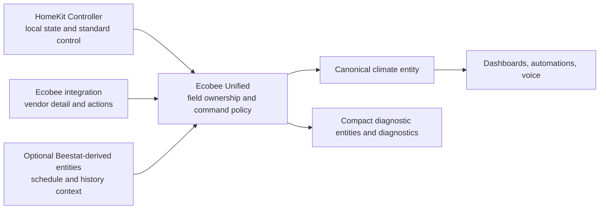

# Architecture

## Outcome

Create one canonical Home Assistant climate entity for each mapped physical
thermostat while retaining the best capabilities of independent backend
integrations. The unified entity is the normal consumer surface; the backend
entities remain enabled for acquisition, specialized sibling data, diagnosis,
and rollback.

## Ownership Boundaries

Ecobee Unified owns mapping, field selection, degradation, command routing,
command confirmation, and unified entities. It does not own transport,
authentication, raw source devices, or historical import.

It must use Home Assistant's public state machine, registry, event, and service
interfaces. It must not import another integration's runtime data object,
write `.storage`, call the Ecobee API, or scrape diagnostics.

Use one config entry to hold multiple thermostat mappings unless current Home
Assistant UX or lifecycle evidence demonstrates that independent entries are
materially better. A mapping contains:

- required HomeKit climate source;
- required Ecobee climate source for the intended full feature set;
- optional Beestat scheduled-profile and next-transition entities; and
- optional explicit room-sensor mappings for derived spatial metrics.

Mappings use entity/device selectors and supported entity-registry tracking so
renames survive. A missing source must not be replaced using name guesses.

## Device Model

Each unified climate entity should link to the selected physical HomeKit
thermostat device using Home Assistant's current helper-device linking pattern.
The integration must not return foreign identifiers or connections and must not
claim co-ownership of that device. If the source device is missing, keep the
entity registered and report degraded/unavailable state.

The link follows the selected source entity rather than only its setup-time
device. Entity/device registry changes reconcile the unified entity's
`device_id`; moving, detaching, removing, or restoring the HomeKit source then
schedules the supported config-entry reload so the live entity and registry
agree without replacing the config entry or stable entity identity.

## Deterministic Field Ownership

| Semantic | Primary | Read fallback | Notes |
|---|---|---|---|
| HVAC mode and action | HomeKit climate | Ecobee climate | Local state is canonical for normal operation. |
| Target temperature/range | HomeKit climate | Ecobee climate | Preserve source-supported unit, bounds, and precision. |
| Current temperature | HomeKit climate `current_temperature` | Ecobee climate `current_temperature` | Never substitute a raw thermostat-local sensor; it can represent a different semantic. |
| Current humidity | HomeKit climate | Ecobee climate | Expose only when valid. |
| Fan mode | HomeKit climate | Ecobee climate | Standard climate capability. |
| Preset/hold and climate mode | Ecobee climate | none | Vendor-specific operating context. |
| Equipment running | Ecobee climate | none | Preserve exact equipment detail; optionally derive a stable stage entity. |
| Minimum fan runtime | Ecobee climate/entity | none | Vendor setting, not HomeKit climate state. |
| Active comfort sensors | Ecobee climate | none | Do not infer from occupancy. |
| Scheduled profile/next transition | Beestat-derived entities | none | Schedule context only; never use as current live state. |
| Room motion/occupancy/battery | HomeKit sibling entities | none | Keep as linked sibling entities; do not copy into climate attributes. |
| Air-quality estimates | Ecobee sibling entities | none | Keep separate; they are contextual estimates, not life-safety measurements. |
| History/filter/alerts | Beestat-derived entities | none | Do not re-export historical series through the climate entity. |

Selection is semantic, not temporal. Do not average duplicate measurements or
select a source merely because its event arrived last. Report chosen source and
source age compactly so provenance remains inspectable without presenting
duplicate normal-use entities.

## Updates and Availability

Subscribe to source state changes and maintain an in-memory snapshot. Entity
properties perform no I/O. Build one normalized per-mapping snapshot and make
the climate entity, diagnostics, and any diagnostic entity project that same
snapshot rather than interpreting raw attributes independently. Availability is
capability-aware:

- HomeKit available: canonical local climate state and standard control work.
- Ecobee available: vendor detail/actions work.
- Beestat available: schedule/history context works.
- A missing optional source removes only its capabilities.
- A missing primary may activate the documented read fallback, accompanied by
  degraded status and provenance.
- If neither climate source can provide a required state, the unified climate
  becomes unavailable rather than inventing state.

Source staleness thresholds must reflect backend cadence and be configurable or
well-documented. Freshness uses Home Assistant's `last_reported` timestamp so a
healthy unchanged report remains fresh; `last_updated` would incorrectly age a
stable value merely because its semantics did not change. Lifecycle-owned
timers reevaluate at stale boundaries even when no new state-change event
arrives. Event handlers use the event-owned stable report/change timestamp
rather than relying on Core's intentionally mutable `State.last_reported`
field. These are health signals, not a reason to reinterpret fields.

## Command Policy

Exactly one backend writes each operation:

| Operation | Writer | Policy |
|---|---|---|
| Set HVAC mode | HomeKit climate | No automatic fallback. |
| Set temperature/range | HomeKit climate | No automatic fallback. |
| Set fan mode | HomeKit climate | No automatic fallback. |
| Resume/clear hold | One explicitly selected action | Prefer one local clear-hold path when equivalent; expose the Ecobee resume action only as a separate, clearly named vendor operation if semantics differ. |
| Set minimum fan runtime | Ecobee action/entity | Vendor-specific. |
| Vacation and occupancy/sensor policy | Ecobee actions | Vendor-specific and opt-in. |

After a standard HomeKit command, mark it pending and observe the Ecobee state
for confirmation. Give every command a monotonically increasing revision and
update confirmation state only if the observation still belongs to the current
revision. A late cloud update must not confirm or fail a superseded command. A
timeout reports an unconfirmed command; it must not send a second write. The
initial confirmation window should exceed two normal Ecobee cloud refresh
intervals and be validated against live behavior. Normal source processing must
continue while confirmation is pending. A matching Ecobee state report counts
as a new observation even when state and attributes are unchanged; report-event
handling is limited to pending mapped commands and retains the same revision
guard.

## Entity Surface

MVP per thermostat:

1. One unified climate entity.
2. At most one diagnostic source-health/problem entity if it provides useful
   automation and visibility beyond diagnostics.
3. A standalone equipment-stage sensor only if its stable state/history is
   more useful than a compact climate attribute.

Keep climate attributes bounded: selected sources, source status/age,
equipment running, active climate mode/sensors, minimum fan runtime, scheduled
profile/next transition, and command confirmation. Do not record large raw
payloads, long lists, or historical samples as attributes. Volatile source age,
active-sensor detail, and command-confirmation age/status remain live attributes
but are excluded from Recorder; bounded redacted diagnostics own their detailed
history-independent evidence.

## Derived Expansion

After MVP correctness, explicit room mappings can support genuinely new
semantics without duplicating raw entities:

- effective program state (scheduled versus hold);
- active-room temperature spread and hottest/coldest active room;
- persistent cross-source disagreement;
- command-confirmation status and latency;
- scheduled sensor-participation anomalies; and
- air-quality trend/context with clear non-safety labeling.

Each derived metric needs a precise definition, unit, availability rule,
Recorder value, and demonstrated consumer before it becomes an entity.
