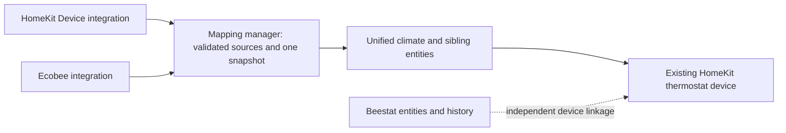

# Architecture and runtime contracts

Ecobee Unified presents a mapped thermostat through one climate entity and a
small set of sibling controls and sensors. Its entities link to the existing
HomeKit thermostat device. The source integrations remain installed and own
their connections, credentials, acquisition, and backend behavior.

This document describes the implementation. [Requirements](requirements.md)
defines acceptance boundaries; [design decisions](decisions.md) explains the
tradeoffs; [upstream contracts](upstream-contracts.md) records external
dependencies and their evidence.

## Configuration and identity

One native config entry contains one or more thermostat mappings. Each mapping
has a generated stable `mapping_id`, a display name, required HomeKit and Ecobee
climate references, and optional source references:

| Source integration | Required | Optional |
|---|---|---|
| HomeKit Device (`homekit_controller`) | Thermostat climate | Temperature sensor, Current Mode select, Clear Hold button |
| Ecobee (`ecobee`) | Thermostat climate | AQI, CO2, VOC sensors and thermostat notification entity |

The config flow validates entity domain and source integration, rejects reused
climates or optional sources, and requires distinct mapping names after
trimming and case normalization. Optional sources must belong to the selected
climate's device. Registry IDs are stored so entity renames do not require
remapping; the integration does not search by display name for replacements.

The physical HomeKit device's serial number must equal the Ecobee device's
single `ecobee` identifier after trimming and case normalization. A new or
changed pair with missing evidence is rejected, as is a known mismatch. An
unchanged saved pair may remain configured while its identity is temporarily
unproven. At runtime, unproven or mismatched identity disables Ecobee-derived
reads, vendor writes, notifications, and metadata fusion while preserving
eligible local HomeKit behavior.

Reconfigure stages add, edit, and remove operations and saves the mapping
collection together. Changing a writer or removing a mapping requires the
flow's confirmation. Finish compares the complete entry data with the snapshot
taken when editing began; concurrent changes abort the save. Timing options use
the same comparison against their original options. Unrecognized additive data
is preserved. Successful changes reload this integration; source restoration
and entity renames are handled through events.

## Device and entity presentation

Unified entities use the supported helper-device link to the HomeKit device.
They do not publish foreign hardware identifiers or claim ownership of that
device. Entity and device registry events update only Unified's own entity
records when the source moves, detaches, disappears, or returns. Stable unique
IDs remain intact. Reconfigure removes only this entry's orphaned Unified
entities when a mapping or optional projection is removed.

| Entity | Created when | Unique ID |
|---|---|---|
| Climate | Every mapping | `mapping_id` |
| Source degraded problem binary sensor | Every mapping | `mapping_id_source_degraded` |
| Minimum fan runtime number | Every mapping | `mapping_id_minimum_fan_runtime` |
| Equipment stage sensor | Every mapping | `mapping_id_equipment_stage` |
| Resume program button | Clear Hold is mapped | `mapping_id_resume_program` |
| Notification entity | Ecobee notification is mapped | `mapping_id_notification` |
| AQI, CO2, VOC sensors | Corresponding sensor is mapped | `mapping_id_air_quality_index`, `mapping_id_co2`, `mapping_id_voc` |

Home Assistant assigns editable entity IDs independently of these stable unique
IDs. Unified does not reclaim existing climate entity IDs or automatically
redirect dashboards and automations. Existing room, occupancy, battery,
equipment-configuration, and Beestat entities retain their own owners.

## Read ownership

Selection is per semantic field. A later event cannot replace the documented
owner merely because it is newer. Values are not averaged or smoothed.

| Field or context | Preferred source | Allowed fallback |
|---|---|---|
| HVAC mode/action, target temperature/range, current humidity, fan mode | HomeKit climate | Usable, identity-verified Ecobee climate |
| Current temperature | Explicit HomeKit temperature sensor passing the checks below | HomeKit climate, then usable identity-verified Ecobee climate |
| Target humidity and bounds | Capability-advertised HomeKit climate | None |
| Current preset and available preset options | Explicit HomeKit Current Mode select | None |
| Ecobee preset/climate context and comfort-sensor names | Ecobee climate attributes | None |
| Equipment stage | Bounded interpretation of Ecobee `equipment_running` | None |
| Minimum fan runtime | Ecobee `fan_min_on_time` | None |
| AQI, CO2, VOC | Explicit same-device Ecobee sensor for that quantity | None |

Controls, modes, units, and safety bounds come from the designated writer. Read
fallback does not enable a cloud writer for a standard climate action. Climate
attributes use Home Assistant's configured Celsius or Fahrenheit unit; the
manager converts a separately mapped temperature sensor into that unit.

There is one metadata exception: when HomeKit has no non-null target step,
Unified can use the same device's Ecobee step under its verified HomeKit writer
granularity contract. The step must be positive, finite, use the same unit, and
fit the HomeKit temperature span. A present invalid HomeKit step is reported
and cannot use this exception. Eligible stale Ecobee capability metadata may
supply the step; stale Ecobee measurements remain unusable. The exception does
not replace local units, bounds, or feature flags.

Ecobee fallback preserves the source integration's `current_temperature`
semantic. It is not a separate measurement acquired by Unified or a guarantee
of independent dry-bulb accuracy; Unified does not fetch `rawTemperature` or
open another API client.

The equipment sensor maps known tokens to a bounded enum, treats an empty
report as idle, and uses `multiple` or `unknown` when it cannot identify a single
known stage. AQI requires the AQI device class and no unit; CO2 requires its
device class and ppm; VOC requires its device class and micrograms per cubic
meter. These are source-provided contextual measurements, not life-safety
detection.

## Temperature quality and recovery

A mapped precise-temperature sensor must retain the HomeKit device association,
temperature device class, a convertible temperature unit, and a finite valid
value. Explicit live class/unit attributes take precedence over registry
defaults, including invalid empty or null attributes. Registry metadata fills
only absent attributes.

Precision is selected only while the sensor agrees with a usable HomeKit
climate temperature within its serialization envelope: approximately 0.05 °C
or 0.5 °F, with a small floating-point allowance. Failure selects the climate
fallback and reports invalid, unavailable, unknown, divergent, or unverifiable
temperature evidence. A selected precise sensor or Ecobee fallback advertises
tenths precision; the HomeKit climate projection uses native climate precision.

HomeKit may publish the climate and precise sensor values sequentially.
Routine healthy paired events use a per-mapping 250 ms trailing-edge window
before snapshot publication. Eligible events are a precise-sensor update or a
climate update whose current temperature changed. Command-confirmation events,
availability transitions, source removal, registry changes, and other source
events bypass this delay. Persistent disagreement still rejects the sensor.

A confirmed rejection creates in-memory recovery evidence tied to the climate
and sensor registry identities and their device binding. Confirmation comes
from the settled pair or a separate 250 ms callback that rereads the same
candidate value. Immediate refreshes cannot make a transient pair a lasting
rejection. After rejection, precise selection requires a different finite
physical value that agrees with the climate. The following do not establish
recovery by themselves:

- A climate value moving toward the unchanged rejected sensor value.
- A new timestamp, repeated report, formatting or display-unit change.
- An unavailable/available cycle or temporary loss of the same source.

While evidence remains, `homekit_temperature_recovery_pending` accompanies the
documented fallback. Values are compared in Celsius so changing display units
cannot manufacture progress. Renames retain evidence; a validated different
source or device binding starts new observations. Evidence is bounded to the
configured mappings and discarded on unload. It cannot detect two agreeing
wrong sources, prove physical accuracy, or remember a rejection after reload.

## Health, degradation, and updates

The manager subscribes to source state and registry events, builds one immutable
normalized snapshot per mapping, and publishes it to the entities. Entity
properties perform no I/O. The climate is available only when it has both a
valid HVAC mode and current temperature; other projections evaluate their own
capabilities or values.

| Condition | Runtime behavior and recovery |
|---|---|
| Quiet HomeKit source | Report age remains diagnostic; elapsed time alone never makes it stale. |
| Ecobee climate or mapped air-quality source exceeds its stale threshold | Its live values become unusable. A timer evaluates the boundary without new events; the next report can recover it even when state and attributes are unchanged. |
| Missing, disabled, unavailable, or unknown source | Preserve the mapping, remove affected values/control, and use only a documented fallback. Supported state or registry recovery reevaluates it. `unknown` remains distinct from `unavailable`. |
| Identity or optional-device association fails | Block affected projections/writers until supported registry evidence is valid again. Do not choose a substitute source. |
| Present malformed numeric field | Reject that field with bounded reasons while retaining transport health. Optional absence is not itself a numeric fault. |
| Invalid writer metadata | Remove the affected capability or metadata; no alternate writer is enabled. |
| Unknown Current Mode with a usable writer | Keep the current preset unknown and retain bounded options; classify this alone as advisory. |

The default Ecobee stale threshold and command-confirmation window are each
1,800 seconds. They are local options, not promises about cloud delivery time.
Only stale-source recovery and the current command observer trigger processing
of otherwise unchanged reports. Healthy unchanged reports do not continually
republish snapshots. Event-owned report timestamps avoid reading a later mutable
timestamp as evidence for an earlier event.

Numeric normalization rejects overflow, non-finite values, humidity outside
0–100 percent, negative air-quality values, and temperatures proven below
absolute zero after accounting for source serialization. It does not impose
household comfort bands on measurements, clip readings, or create substitutes.
Eligibility failures such as invalid source metadata are separate from these
field-level numeric checks.

The Source degraded binary sensor is on when normalized `problem_reasons` is
nonempty. Climate attributes and diagnostics share the same classification.
The complete `degradation`/`reasons` union remains available for compatibility;
`advisories` currently contains only an unknown but otherwise writable Current
Mode. Clear Hold and notification availability are separate writer capabilities
and are not included as source-health rows or temperature-style degradation
reasons. Their entity availability and diagnostics expose capability loss.

Repairs report configured registry, device, identity, or semantic mapping faults.
They are nonpersistent issues evaluated on refresh, with no elapsed-duration
threshold, and disappear when their conditions recover. Ordinary source
staleness and command timeout do not themselves create those mapping Repairs.

## Commands and their evidence

Every accepted request dispatches through one mapped source-service target.
Unified adds no retry or alternate writer. This limits Unified's calls; it does
not promise exactly-once physical execution inside another integration or the
thermostat. Caller-provided data cannot override the resolved mapped target.

| Operation | Sole writer | Observation used by command tracking |
|---|---|---|
| HVAC mode, on/off, temperature/range, fan mode | HomeKit climate service | Ecobee climate report |
| Target humidity | HomeKit climate service | HomeKit climate report |
| Preset | Mapped HomeKit Current Mode select | That select's report |
| Resume program/Clear Hold | Mapped HomeKit button | None; successful call is `submitted` |
| Minimum fan runtime | Ecobee `set_fan_min_on_time` | Ecobee climate report |
| Create/delete vacation, occupancy modes, comfort-sensor participation | Corresponding Ecobee service | None; successful call is `submitted` |
| Thermostat notification | Mapped Ecobee notify entity | Native call result only; not included in command tracking |

Current Mode options must be a nonempty subset of Home, Sleep, and Away, with
compatible public entity metadata. A writable select may have an `unknown`
current value. Clear Hold needs only its own eligible same-device button; its
public registry metadata can rule out incompatible buttons but cannot prove
the selected button's meaning. That selection remains explicit user intent.

Minimum fan runtime accepts 0–60 minutes in five-minute steps. Vacation actions
use the Ecobee writer's unit and bounds and validate their period and options.
Comfort-sensor participation accepts explicit Ecobee devices from the mapped
source config entry, translates built-in preset names for the vendor action,
and uses current Ecobee climate context when a preset is omitted. Notifications
forward a nonempty message; the unsupported title is ignored. Field details
belong to the [action help](../custom_components/ecobee_unified/services.yaml).

One lock serializes service dispatch per mapping within a running manager,
including notifications. It is held until the source call finishes, not until
cloud confirmation arrives. Tracked commands keep only the latest command per
mapping, with an increasing revision and operation name. A later tracked
command replaces the previous tracking record.

The current operation's observer is installed before dispatch. A matching
in-flight report, including an unchanged report, can be retained, but
`confirmed` requires the writer call to succeed. A source error marks the
tracked request `failed`; it does not prove that no physical effect occurred.
The timeout starts after writer success. Expiration marks it `unconfirmed`
without another write. Temperature confirmation uses half the available target
step plus a floating-point allowance; without a step it uses the fixed numeric
tolerance of 0.11. Other numeric confirmation retains that fixed tolerance.

Revisions prevent late observations, results, or deadlines from overwriting a
newer tracked command. Stopping the manager closes admission, rejects queued
dispatches, marks pending tracked work unconfirmed, and removes subscriptions
and timers. An already dispatched source call may still finish. Neither unload
nor caller cancellation can undo its physical effect; late completion cannot
restart the stopped manager or cause replay.

## Privacy, Recorder, and ownership outside Unified

Downloadable diagnostics are built from an allowlist. They include anonymous
mapping positions, capability flags, source health and ages, selected-source
roles, degradation, and recent command metadata. They omit mapping names,
entity/device/config-entry IDs, raw measurements, sensor names, command payloads,
credentials, and raw backend responses. Wrapped source errors use bounded
translated messages without retaining arbitrary backend exception text.

Local climate attributes retain bounded vendor context and comfort-sensor names.
`active_comfort_sensors` and the compatibility alias
`configured_comfort_sensors` contain the same Ecobee source list; the latter is
not an independently acquired schedule roster. These lists, command status,
and the problem/advisory classification are excluded from climate Recorder
attributes. Problem-entity detail attributes are also unrecorded. Exact source
and command ages are calculated only when diagnostics are requested, so quiet
intervals do not generate age-only entity updates. The equipment sensor records
its bounded enum rather than raw equipment text. Ordinary entity state and
other attributes remain subject to Home Assistant's Recorder configuration.

Unified owns mapping, normalization, source-derived controls, and their runtime
status. Beestat owns its own cloud history and derived context; Unified neither
consumes its entities nor duplicates its historical series, schedule, alerts,
or filters. Beestat device linkage depends on Beestat's configuration and is
not performed by Unified.

Household schedules, occupancy decisions, notification policy, cross-service
automations, dashboards, and private operational evidence belong to the local
Home Assistant configuration. Reusable vendor action facades can remain in
Unified without deciding when a household should invoke them. No additional integration,
credential owner, or history store is required by this boundary.

## Source map

| Responsibility | Implementation |
|---|---|
| Mapping and options flow | [config_flow.py](../custom_components/ecobee_unified/config_flow.py) |
| Public registry and source-role checks | [source_contracts.py](../custom_components/ecobee_unified/source_contracts.py) |
| Events, lifecycle, dispatch, Repairs, device links | [manager.py](../custom_components/ecobee_unified/manager.py) |
| Field normalization and shared degradation | [models.py](../custom_components/ecobee_unified/models.py) |
| Rejected-temperature evidence | [temperature_quality.py](../custom_components/ecobee_unified/temperature_quality.py) |
| Latest-command revisions and statuses | [commands.py](../custom_components/ecobee_unified/commands.py) |
| Entity identity and no-I/O base | [entity.py](../custom_components/ecobee_unified/entity.py) |
| Diagnostic allowlist | [diagnostics.py](../custom_components/ecobee_unified/diagnostics.py) |
